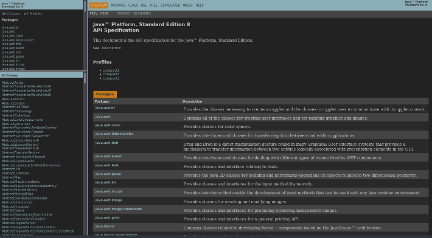
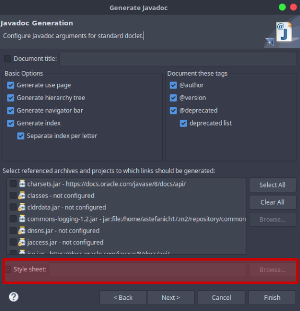

# Midnight Javadoc Stylesheet

## Usage
1) <i>Existing Projects</i>  
-Copy the new stylesheet into your project's Javadoc base directory. 
-Delete any existing files named "stylesheet.css" and rename the new file to "stylesheet.css". 
OR 
-Copy the new stylesheet into your project's Javadoc base directory. 
-Change the CSS reference in index.html to "stylesheet_javadoc-midnight.css"

2) <i>New Builds</i>  
a)<a href="https://maven.apache.org/plugins/maven-javadoc-plugin/examples/stylesheet-configuration.html"> Maven</a>  
b) Eclipse: select a custom stylesheet in the generator steps.   

